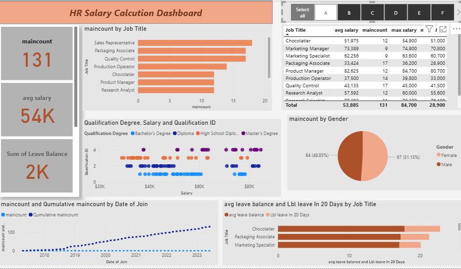

# Hi there, I'm Abu Sufian 👋  
*Data Analyst | Excel, SQL, Power BI Enthusiast | Business & Technology Integrator*

---

## About Me
I am a Management graduate with a passion for turning data into actionable insights. I specialize in **financial reporting, data analysis, and business operations**. My goal is to **streamline processes, improve decision-making, and support business growth** using tools like **Excel, SQL, and Power BI**.  

I love exploring new technologies, learning advanced analytics techniques, and building dashboards that tell a story with data.  

---

### 🛠 Skills

**Data Analytics & Tools**  
- Microsoft Excel (PivotTables, Power Query, SUMIFS, VLOOKUP)  
- SQL (CRUD, Joins, Aggregates, CTEs)  
- Power BI (Dashboards, DAX, MTD/YTD Analysis)  
 

**Business Analysis**  
- Data visualization & reporting  
- Financial statement analysis  
- Performance tracking & actionable insights  

**Statistics & Research**  
- Trend analysis & correlation  
- Descriptive statistics & probability

**Programming & Backend**  
- Python (Basic syntax, Learning)
- JavaScript (Core concepts, basic projects)    
- Backend Foundations (Node.js, APIs, CRUD operations) 

**Professional Competencies**  
- Problem-solving & critical thinking  
- Communication & teamwork  
- Adaptability & time management

---

## 📊 Projects

### 1. [Excel & SQL Retail Shop Sales Analysis](https://github.com/abu-sufian015/Retail_Shop)  
Used SQL and Excel to study sales data and find important trends. Found the top customers and suggested ways to keep them happy. Showed which products made the most money using Excel charts and PivotTables. Gave practical recommendations to help the business make better decisions.

  

### 2. [Power BI HR Analysis Dashboard](https://github.com/abu-sufian015/hr-project)  
Designed and developed an HR analytics dashboard to track salary trends, leave balances, and staff growth over time. Analyzed the relationship between employee qualifications and salary levels, identifying key insights for decision-making. Visualized workforce demographics, including gender and age distribution, to support diversity and HR planning. Created interactive reports that enable quick access to critical HR KPIs for managers.

---

## 📫 Connect with Me
- **Email:** ab.sufian1997@gmail.com  
- **LinkedIn:** [linkedin.com/in/abusufian015](https://linkedin.com/in/abusufian015)  

---

## 🌟 Fun Fact
I love **traveling** and exploring **AI tools**, always looking for ways to improve my skills and learn something new every day!  

---

